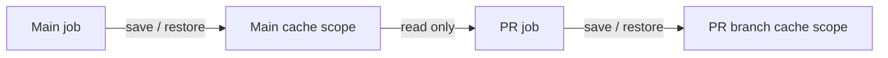
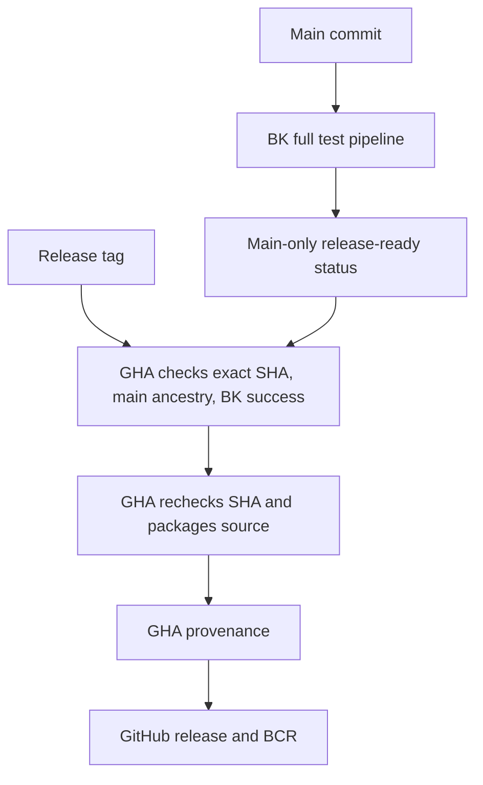
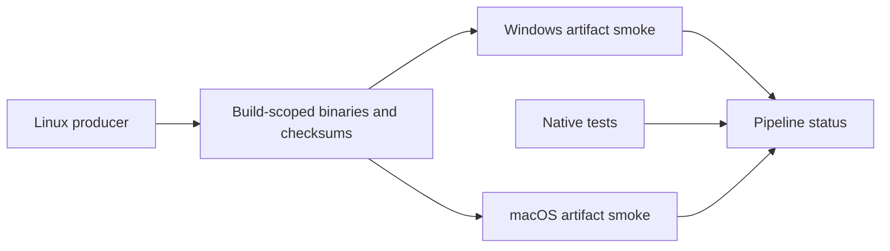

# Buildkite CI

Linux tests/examples and target analysis run on `oss` (8 vCPUs, 32 GB RAM).
One producer cross-builds Linux AMD64 and macOS ARM64 smoke executables per Bazel
version. Smoke downloads and runs those artifacts on `oss` and
`oss_darwin_arm64` (M4, 12 vCPUs, 56 GB RAM), including approved PR builds.
Hook dependencies are installed on every build; titles/commits are checked on PRs.
The post-checkout hook tests GitHub's PR merge ref, matching `actions/checkout`.
It rejects stale merge refs that do not contain the expected PR head.
Bootstrap pins that merge SHA in build metadata so every job tests the same tree.
The trusted bootstrap skips repository checkout and checks GitHub PR metadata
first. Forks require a pipeline writer to approve that commit before any fork
checkout/hooks. Only GitHub's `renovate[bot]` identity (ID `29139614`, type `Bot`)
bypasses fork approval. New commits get new builds and approvals; API errors or
stale PR heads fail closed.
Bazel 9.0.0 and 8.6.0 run independently. Bazelisk and Node are checksum-pinned.

## Cache isolation

Bazel jobs use the `oss-ci-v2` registry with server-enforced pipeline/branch scopes.
PRs restore their own branch or main; writes stay in their verified branch.
Main restores only main. Trigger-created builds cannot save to main: trigger
steps can request arbitrary branch names. Main writes require verified build
source `webhook`, `ui`, `api`, or `schedule`. GitHub **Prefix third-party fork branch names** must stay
on, so a fork branch named `main` cannot write the real main scope. Cache keys and
PR-controlled YAML are not access controls.

Shared hosted cache volumes are removed. Only repository/action caches persist;
Bazelisk and downloaded tools start fresh per job. The new registry starts empty,
so existing untrusted cache entries are never restored. Initial builds run cold.

Create the registry once in the OSS cluster with `.buildkite/cache-policy.json`.
Do not replace it with the unrestricted default registry. Policy scopes come from
Buildkite's authenticated job claims, not environment variables supplied by jobs.



Release Please/BCR publishing remain on GitHub Actions. BCR's provenance verifier
checks GitHub attestations from the bazel-contrib release/publish workflows;
running those actions on Buildkite does not preserve that identity. GitHub-managed
CodeQL default setup remains enabled. The native pipeline replaces `ci.yaml` and
`verify-hooks.yml`; `main` requires `buildkite/gazelle-py` from the Buildkite app.

## Pipeline settings

1. In `perplexity/gazelle-py`, paste `.buildkite/bootstrap.yml` into pipeline
   settings and use the `OSS` cluster. The first step must be inline there;
   loading a bootstrap from the PR checkout would let fork code bypass approval.
2. Disable the GitHub Actions pipeline trigger. Enable native GitHub webhook
   processing, pushes to `main`, PR opened/updated/reopened/edited events, and
   merge-group checks. Enable Buildkite commit status reporting. Leave tag
   builds off; releases remain on GitHub Actions. Set blocked build statuses to
   Pending. Enable third-party fork builds only after installing this bootstrap.
3. Require `buildkite/gazelle-py` from the Buildkite app in the `main` ruleset.
   PRs, main and merge groups run Linux tests/examples, artifact smoke and commit
   validation. Keep Release Please and module-release on GitHub Actions.

The bootstrap must specify `queue: oss`: this cluster's `default` queue is
self-hosted. Use isolated, credential-free agents for contributor PRs. Enable
fork builds with the trusted approval bootstrap above. Keep workflow access
tokens disabled and pipeline/cluster secrets unavailable to these jobs.

PR validation reads public GitHub metadata without a token. GitHub API rate
limits fail the check rather than silently skipping title validation. Builds for
superseded PR heads must be rerun at the current head.

Validate configuration locally:

```sh
bk pipeline validate --file .buildkite/bootstrap.yml --file .buildkite/pipeline.yml
bash -n .buildkite/bazel.sh .buildkite/verify-hooks.sh .buildkite/hooks/post-checkout
```

For a cutover smoke test, open a docs-only PR with a Conventional Commit title.
Confirm the GitHub webhook starts a native Buildkite build with both Bazel
matrices and the PR title/commit check.


## Releases

GHA waits for `release-ready/gazelle-py` on the exact release tag commit. Only non-PR main builds publish that status, after the full BK pipeline finishes. Failed builds stop publication; missing/pending checks time out after 90 minutes. No new secrets or BK token permissions.

The reusable GHA release workflow checks that its checkout still matches the verified SHA, packages the source archive, attests provenance, and publishes BCR. Its duplicate Bazel test run and Bazel caches are disabled. Existing runner exceptions remain on GHA.



## Artifact smoke

For each Bazel version, one Linux producer links Linux AMD64, macOS ARM64, and Windows AMD64 Gazelle binaries and unit-test executables. All three smoke jobs download those exact executables, run the compiled unit tests, then generate and recheck a BUILD file from a small language fixture. No Bazel, Cargo, Go compiler, or cache restoration in smoke. Native module/consumer tests remain separate. Other cross-platform analysis checks remain analysis checks.

Downloads are scoped to the producer step in the same build. Manifest checks build ID, pipeline, commit, Bazel version, platform, and SHA-256 before execution. Missing or mismatched artifacts fail; no rebuild fallback. Artifacts are transport, not shared writable caches. Smoke runs on PRs too, after the existing fork approval gate.



Windows artifact smoke runs on `oss_win_amd64` using PowerShell. It pins the same PR merge commit as the Linux producer, verifies the manifest and hashes, then runs compiled unit tests and a generation fixture. No Windows compilation or shared cache.
