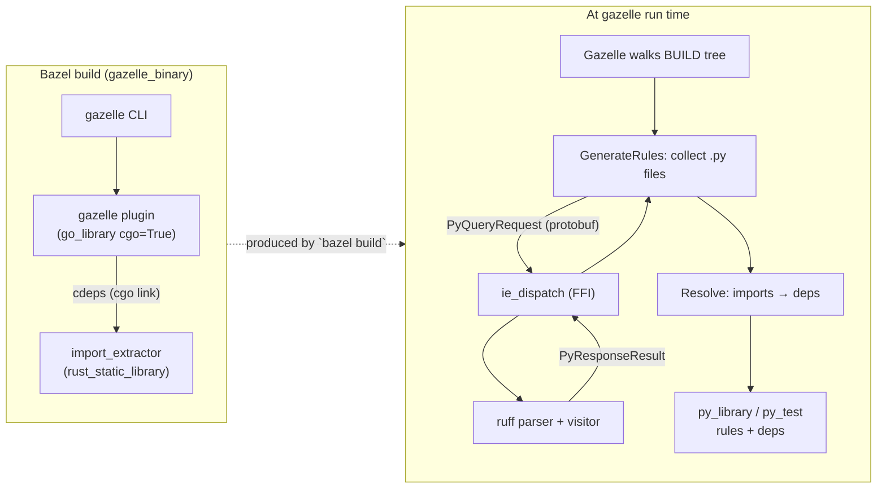

# gazelle_py

A Gazelle language extension for Python, paired with a Rust import-extractor that the plugin links in via cgo.

Built on **Bazel 9 (bzlmod)** with [`rules_rs`](https://github.com/dzbarsky/rules_rs) for the Rust side and `rules_python` for the rules it emits.

## Layout

```
crates/
└── import_extractor/         # Rust staticlib: ruff-based Python import extraction.
                              # Linked into the gazelle plugin via cgo.
proto/                        # Wire format shared by Rust + Go (proto_library).
py/                           # Go-based Gazelle language extension that emits
                              # stock py_library / py_test rules.
platforms/                    # Toolchain platform constraints.
examples/                     # (TBD) self-contained example workspaces.
```

## Architecture



## What this repo gives you

- **`py`** — Gazelle Python language extension. Generates and maintains `BUILD.bazel` files for Python packages, emitting stock [`py_library`](https://rules-python.readthedocs.io/en/stable/api/rules_python/python/defs.html#py_library) and [`py_test`](https://rules-python.readthedocs.io/en/stable/api/rules_python/python/defs.html#py_test) rules. Consumers swap to their own macros via `# gazelle:map_kind`. Compose your own `gazelle_binary(languages = ["@gazelle_py//py"])`. See [`py/README.md`](py/README.md).
- **`crates/import_extractor`** — Rust staticlib that parses Python imports via [`ruff`](https://github.com/astral-sh/ruff)'s parser. Exposes a 2-function C ABI (`ie_dispatch` / `ie_free`); the gazelle plugin links it via cgo and dispatches in-process — no subprocess startup, no JSON serialization, just protobuf bytes across the FFI boundary. See [`crates/import_extractor/README.md`](crates/import_extractor/README.md).

## Why cgo, not a subprocess?

Earlier iterations (and the upstream [`rules_python_gazelle_plugin`](https://github.com/bazelbuild/rules_python/tree/main/gazelle)) ship a long-lived parser subprocess and pipe length-prefixed protobuf frames over stdin/stdout. That works, but it adds:

- per-run process startup cost,
- a brittle path-to-binary lookup (`runfiles.Rlocation`, fallback env vars),
- a parallel goroutine dance for read/write buffering, and
- another set of failure modes (`stderr` noise, child exits mid-batch).

Linking the parser as a static library and calling it via cgo collapses all of that into a single function call. The Rust side keeps `rayon`, so per-batch parallelism is preserved.

## Build

```bash
bazel test //...
```

Tests run on Linux x86_64 + macOS arm64 (mirroring [`gazelle_ts`](https://github.com/hermeticbuild/gazelle_ts)).
