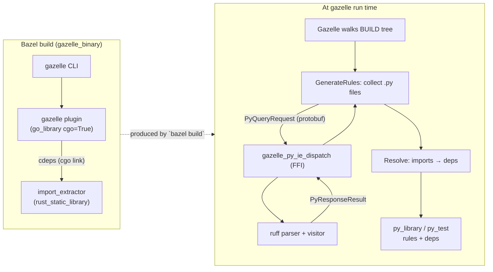
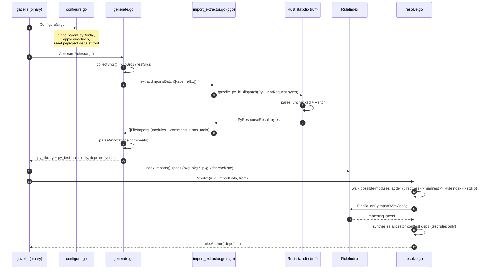
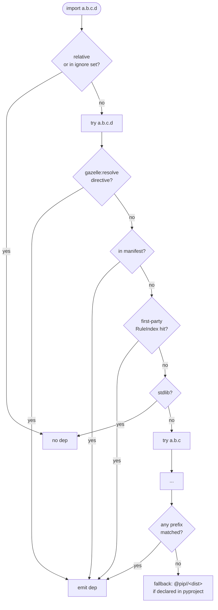

# gazelle_py

A Gazelle language extension for Python, paired with a Rust import-extractor that the plugin links in via cgo.

Tested on **Bazel 8.5+ and 9.x (bzlmod)** with [`rules_rs`](https://github.com/dzbarsky/rules_rs) for the Rust side and `rules_python` for the rules it emits. The `bazel_compatibility` floor matches rules_rs's; we don't use anything beyond what it requires.

## Layout

```
crates/
└── import_extractor/         # Rust staticlib: ruff-based Python import extraction.
                              # Linked into the gazelle plugin via cgo.
proto/                        # Wire format shared by Rust + Go (proto_library).
py/                           # Go-based Gazelle language extension that emits
                              # stock py_library / py_test rules.
platforms/                    # Toolchain platform constraints.
examples/                     # Self-contained example workspaces (basic, composite).
```

## Architecture



## What this repo gives you

- **`py`** — Gazelle Python language extension. Generates and maintains `BUILD.bazel` files for Python packages, emitting stock [`py_library`](https://rules-python.readthedocs.io/en/stable/api/rules_python/python/defs.html#py_library) and [`py_test`](https://rules-python.readthedocs.io/en/stable/api/rules_python/python/defs.html#py_test) rules. Consumers swap to their own macros via `# gazelle:map_kind`. Compose your own `gazelle_binary(languages = ["@gazelle_py//py"])`.
- **`crates/import_extractor`** — Rust staticlib that parses Python imports via [`ruff`](https://github.com/astral-sh/ruff)'s parser. Exposes a 2-function, plugin-namespaced C ABI (`gazelle_py_ie_dispatch` / `gazelle_py_ie_free`); the gazelle plugin links it via cgo and dispatches in-process — no subprocess startup, no JSON serialization, just protobuf bytes across the FFI boundary. See [`crates/import_extractor/README.md`](crates/import_extractor/README.md).

## Usage

Add `gazelle_py` to your `MODULE.bazel` (current version is `0.0.0`; replace once a release is tagged):

```starlark
bazel_dep(name = "rules_python", version = "1.5.4")
bazel_dep(name = "gazelle", version = "0.50.0")
bazel_dep(name = "gazelle_py", version = "0.0.0")
```

> [!NOTE]
> `gazelle_py` registers a hermetic `@llvm` cc toolchain (so the rules_rs Rust toolchain doesn't trip Bazel's Xcode autodetect on macOS). To use it from a consumer workspace you have to mirror the flags below in your own `.bazelrc` — Bazel only reads the consumer's rc, not a dep's:
>
> ```
> common --enable_platform_specific_config
>
> # Linux: pin host_platform so rules_rs's Rust toolchains match the
> # gnu.2.28 libc constraint they tag via target_compatible_with.
> common:linux --host_platform=@gazelle_py//platforms:local_gnu
>
> # Suppress Bazel's autodetected cc toolchain so @llvm wins resolution
> # cleanly. NO_APPLE specifically avoids the XcodeLocalEnvProvider
> # duplicate-SDKROOT crash on macOS.
> common --repo_env=BAZEL_DO_NOT_DETECT_CPP_TOOLCHAIN=1
> common --repo_env=BAZEL_NO_APPLE_CPP_TOOLCHAIN=1
>
> # rust stdlib's link spec hardcodes -lgcc_s; @llvm's clang doesn't
> # ship it, so we inject an empty stub.
> common --@llvm//config:experimental_stub_libgcc_s=True
>
> # rules_go cgo external link via clang+lld can't produce PIE. Drop
> # when Go 1.27 (Aug 2026) lands PIE-compatible objects.
> build:linux --linkopt=-no-pie
> ```
>
> See [`examples/basic/.bazelrc`](examples/basic/.bazelrc) for a working setup.

In your root `BUILD.bazel`, compose a `gazelle_binary` that includes our language and wire up a `gazelle` runner:

```starlark
load("@gazelle//:def.bzl", "gazelle", "gazelle_binary")

# gazelle:python_visibility //visibility:public

gazelle_binary(
    name = "gazelle_bin",
    languages = ["@gazelle_py//py"],
)

gazelle(
    name = "gazelle",
    gazelle = ":gazelle_bin",
)
```

We ship just the Language; you compose your own `gazelle_binary` so multiple gazelle plugins (`go`, `proto`, `python`, …) can be combined into one binary. Then run:

```bash
bazel run //:gazelle       # generate / update BUILD.bazel files
bazel run //:gazelle -- update -mode=diff   # idempotency check
```

The plugin walks the directory tree, parses every `.py` for imports via the Rust extractor, and emits stock [`py_library`](https://rules-python.readthedocs.io/en/stable/api/rules_python/python/defs.html#py_library) (one per dir with sources) plus [`py_test`](https://rules-python.readthedocs.io/en/stable/api/rules_python/python/defs.html#py_test) rules (matched against `*_test.py`, `test_*.py`, `tests/**`, `test/**`). `deps` are filled in from a manifest, the first-party `RuleIndex`, or the `pip_parse` repo, in that order.

By default the plugin emits:

- `py_library` for libraries (loaded from `@rules_python//python:defs.bzl`)
- `py_test` for tests (loaded from `@rules_python//python:defs.bzl`)

If you have your own macros, use `# gazelle:map_kind` to swap.

Self-contained example workspaces live under [`examples/`](examples/):

| Example | What it shows |
|---|---|
| [`basic/`](examples/basic) | Single Python package, stdlib-only imports, sibling test. Smallest useful setup. |
| [`composite/`](examples/composite) | Multi-package layout exercising the first-party `RuleIndex` for cross-directory imports. |
| [`edge_cases/`](examples/edge_cases) | Nested-block imports (function/class bodies, `if TYPE_CHECKING:`, `try/except ImportError`) — regression net for the ruff visitor. |
| [`file_mode/`](examples/file_mode) | `python_generation_mode = file` — one library/test rule per `.py` file. |
| [`project_mode/`](examples/project_mode) | `python_generation_mode = project` — entire subtree rolled into a single library/test rule. |
| [`naming_conventions/`](examples/naming_conventions) | `$package_name$` naming placeholders, `python_skip_empty_init`, and the comma-list `python_test_file_pattern` replacement. |

Each example points its `MODULE.bazel` at this repo via `local_path_override`.

## Plugin lifecycle

The plugin runs through Gazelle's standard three-phase lifecycle. This traces a single directory's processing:



The Rust crate at [`crates/import_extractor`](crates/import_extractor) is built as a `rust_static_library` and linked into the Go plugin via `cdeps`. Calls into it go through cgo - no subprocess, no IPC.

## Configuration

All configuration is via `# gazelle:<key> <value>` directives in `BUILD.bazel` files (they inherit into subdirectories). Directive keys mirror [rules_python's gazelle plugin](https://rules-python.readthedocs.io/en/latest/gazelle/docs/index.html) so you can swap between the two without rewriting BUILD-file directives.

The one exception is `python_source_extension`, which has no rules_python analog - rules_python hardcodes `.py`/`.pyi`.

| Directive | Default | Notes |
|---|---|---|
| `python_extension` | `enabled` | `enabled` / `disabled` (also accepts `true`/`false`). Disable per-tree to skip directories owned by another tool. |
| `python_library_naming_convention` | _(package basename, e.g. `server` for `//apps/server`)_ | Name of the generated library rule. Supports the rules_python `$package_name$` placeholder (expands to the package basename). |
| `python_test_naming_convention` | _(package basename + `_test`)_ | Name of the generated test rule. Same `$package_name$` placeholder as the library convention. |
| `python_library_kind` | `py_library` | Override emitted library kind without `map_kind`. (Ours; rules_python doesn't have a kind override directive.) |
| `python_test_kind` | `py_test` | Override emitted test kind without `map_kind`. |
| `python_visibility` | `//visibility:public` | Space-separated label list. |
| `python_test_file_pattern` | `*_test.py`, `test_*.py`, `tests/**`, `test/**` | Comma-separated values **replace** the defaults (matches rules_python). A bare single value (no comma) is appended to the existing list as a convenience for adding one extra pattern. |
| `python_source_extension` | `.py` | Repeatable; appended. (Ours; rules_python hardcodes `.py`/`.pyi`.) |
| `python_generation_mode` | `package` | `package` / `file` / `project`. `package` emits one library + one test rule per directory. `file` emits one rule per source file (named after the file's basename). `project` rolls every `.py` under the directive's directory into a single library/test rule and skips generation in subdirectories - adopt only after clearing pre-existing per-package `BUILD.bazel` files in the subtree. |
| `python_skip_empty_init` | `false` | When true, skip emitting a library rule when every source is an empty (or comments-only) `__init__.py` - covers both a single-file package and a project-mode rollup of nested empty inits. Mixed packages still emit the rule and keep `__init__.py` in `srcs` so relative imports (`from . import x`) resolve. |
| `python_label_convention` | `@pip//{pkg}` | Template; `{pkg}` is replaced with the resolved distribution name. |
| `python_manifest_file_name` | _(empty)_ | Workspace-relative path to a `gazelle_python.yaml` (rules_python format). When set, its `modules_mapping` overrides built-in import -> distribution heuristics, and its `pip_repository.name` swaps the repo segment of `python_label_convention`. |
| `python_root` | _(workspace root)_ | Marks the current package as the Python project root: dotted import paths under it are interpreted relative to this directory. Set on a parent BUILD file in monorepos with multiple Python projects sharing one workspace (e.g. `backend/`, `tools/python/`). The directive's value is ignored - it picks up the BUILD file's own path. |
| `python_resolve_sibling_imports` | `false` | When true, bare-module imports (`from app import X`) resolve as siblings of the importer's package. Lets a sibling `app.py` resolve to the local library even when the test references it as a top-level module name. Off by default to match rules_python and avoid surprising cross-package matches. |
| `python_label_normalization` | `snake_case` | How distribution names are normalized when rendering pip labels: `snake_case` (default; lowercase + `[-.]` -> `_`), `pep503` (lowercase + runs of `[-_.]` -> `-`), or `none` (identity). Pick `pep503` if your pip repo keys directly on PEP 503 names. |

Plus per-source-file annotations inside `.py` files:

```python
# gazelle:ignore foo,bar          # skip these modules in this file
# gazelle:include_dep //extra:dep # always add this dep to the rule
import foo
import bar
import baz
```

`# gazelle:ignore` accepts either space- or comma-separated module names. The match is prefix-based: ignoring `a.b` covers `a.b.c.D` and the `from` part of `from a.b import x`.

## Import resolution

For each import the resolver walks a "possible modules" ladder, trying progressively shorter dotted prefixes (`a.b.c.d` -> `a.b.c` -> `a.b` -> `a`). At each prefix it checks every source in order before stepping shorter - that ordering matters: a single `# gazelle:resolve py <broad> <label>` directive must not steal an import that's actually a deeper, more specific submodule provided by another rule.



1. `pyproject.toml`, `requirements.txt`, and `requirements.in` (if present) are read once at the repo root for declared distribution names.
2. If `python_manifest_file_name` points at a `gazelle_python.yaml`, the file's `modules_mapping` is loaded once on first use.
3. Per import, run the possible-modules ladder shown above.
4. **Test rules** resolve only the imports the test files themselves declare - the sibling `:lib` target is reached transitively when the test imports it by module name. `conftest.py` at a package's own root is automatically extracted into its own `py_library` rule named `:conftest` with `testonly = True` (matching rules_python's gazelle plugin); it is not bundled into the package's main library. The plugin synthesizes imports for every ancestor directory containing a `conftest.py`, so the dedicated `:conftest` target is picked up transitively, while plain `from x.conftest import ...` statements (and self-imports) are dropped.

## Custom macros

Suppose you want to emit your own `myrepo_py_library` macro instead of stock `py_library`. Add this to your root BUILD file:

```starlark
# gazelle:map_kind py_library myrepo_py_library //tools:py.bzl
# gazelle:map_kind py_test    myrepo_py_test    //tools:py.bzl
```

The plugin still emits the stock kinds; Gazelle rewrites the kind name and load path on disk. Your macro must accept the attrs the plugin sets (`name`, `srcs`, `deps`, `visibility`).

## Build

```bash
bazel test //...
```

CI runs the full matrix: `{linux-x86_64, macos-arm64} × {bazel 9.0.0, bazel 8.6.0}` for the top-level test job, plus the `basic` and `composite` example workspaces against both Bazel versions on Linux. The BCR presubmit covers `{debian11, macos, ubuntu2204} × {9.x, 8.5.x}`.
