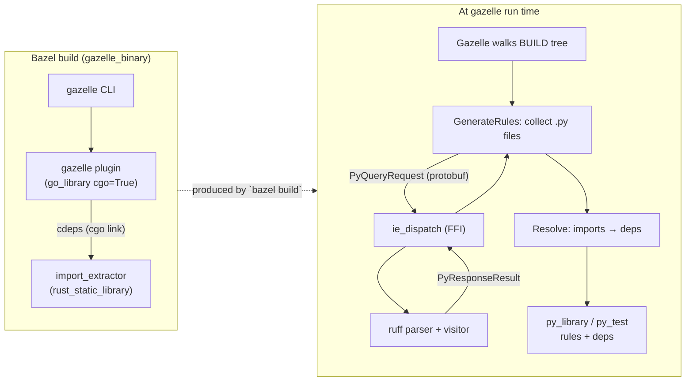

# gazelle_py

A Gazelle language extension for Python, paired with a Rust import-extractor that the plugin links in via cgo.

Tested on **Bazel 8.5+ and 9.x (bzlmod)** with [`rules_rs`](https://github.com/dzbarsky/rules_rs) for the Rust side and `rules_python` for the rules it emits. The `bazel_compatibility` floor matches rules_rs's; we don't use anything beyond what it requires.

## Layout

```
crates/
└── import_extractor/         # Rust staticlib: ruff-based Python import extraction.
                              # Linked into the gazelle plugin via cgo.
proto/                        # Wire format shared by Rust + Go (proto_library).
py/                           # Go-based Gazelle language extension that emits
                              # stock py_library / py_test rules.
platforms/                    # Toolchain platform constraints.
examples/                     # Self-contained example workspaces (basic, composite).
```

## Architecture



## What this repo gives you

- **`py`** — Gazelle Python language extension. Generates and maintains `BUILD.bazel` files for Python packages, emitting stock [`py_library`](https://rules-python.readthedocs.io/en/stable/api/rules_python/python/defs.html#py_library) and [`py_test`](https://rules-python.readthedocs.io/en/stable/api/rules_python/python/defs.html#py_test) rules. Consumers swap to their own macros via `# gazelle:map_kind`. Compose your own `gazelle_binary(languages = ["@gazelle_py//py"])`. See [`py/README.md`](py/README.md).
- **`crates/import_extractor`** — Rust staticlib that parses Python imports via [`ruff`](https://github.com/astral-sh/ruff)'s parser. Exposes a 2-function C ABI (`ie_dispatch` / `ie_free`); the gazelle plugin links it via cgo and dispatches in-process — no subprocess startup, no JSON serialization, just protobuf bytes across the FFI boundary. See [`crates/import_extractor/README.md`](crates/import_extractor/README.md).

## Usage

Add `gazelle_py` to your `MODULE.bazel` (current version is `0.0.0`; replace once a release is tagged):

```starlark
bazel_dep(name = "rules_python", version = "1.5.4")
bazel_dep(name = "gazelle", version = "0.50.0")
bazel_dep(name = "gazelle_py", version = "0.0.0")
```

> [!NOTE]
> On Linux, `rules_rs`'s Rust toolchains tag a `gnu.2.28` libc constraint via `target_compatible_with`. You'll need to point your host platform at one with that constraint or borrow ours from `@gazelle_py//platforms:local_gnu`. Add this to your `.bazelrc`:
>
> ```
> common --enable_platform_specific_config
> common:linux --host_platform=@gazelle_py//platforms:local_gnu
> ```
>
> macOS doesn't need this. See [`examples/basic/.bazelrc`](examples/basic/.bazelrc) for a working setup.

In your root `BUILD.bazel`, compose a `gazelle_binary` that includes our language and wire up a `gazelle` runner:

```starlark
load("@gazelle//:def.bzl", "gazelle", "gazelle_binary")

# gazelle:python_visibility //visibility:public

gazelle_binary(
    name = "gazelle_bin",
    languages = ["@gazelle_py//py"],
)

gazelle(
    name = "gazelle",
    gazelle = ":gazelle_bin",
)
```

We ship just the Language; you compose your own `gazelle_binary` so multiple gazelle plugins (`go`, `proto`, `python`, …) can be combined into one binary. Then run:

```bash
bazel run //:gazelle       # generate / update BUILD.bazel files
bazel run //:gazelle -- update -mode=diff   # idempotency check
```

The plugin walks the directory tree, parses every `.py` for imports via the Rust extractor, and emits stock [`py_library`](https://rules-python.readthedocs.io/en/stable/api/rules_python/python/defs.html#py_library) (one per dir with sources) plus [`py_test`](https://rules-python.readthedocs.io/en/stable/api/rules_python/python/defs.html#py_test) rules (matched against `*_test.py`, `test_*.py`, `tests/**`, `test/**`). `deps` are filled in from a manifest, the first-party `RuleIndex`, or the `pip_parse` repo, in that order.

Two end-to-end example workspaces live under [`examples/`](examples/):

| Example | What it shows |
|---|---|
| [`basic/`](examples/basic) | Single Python package, stdlib-only imports, sibling test. Smallest useful setup. |
| [`composite/`](examples/composite) | Multi-package layout exercising the first-party `RuleIndex` for cross-directory imports. |

Each example points its `MODULE.bazel` at this repo via `local_path_override`.

## Configuration

All configuration is via `# gazelle:<key> <value>` directives in `BUILD.bazel` files (they inherit into subdirectories). Directive keys mirror [rules_python's gazelle plugin](https://rules-python.readthedocs.io/en/latest/gazelle/docs/index.html) so you can swap between the two without rewriting BUILD-file directives.

The most common ones:

| Directive | Default | Notes |
|---|---|---|
| `python_extension` | `enabled` | `enabled` / `disabled` toggle (also accepts `true`/`false`). |
| `python_visibility` | `//visibility:public` | Visibility for generated rules. |
| `python_generation_mode` | `package` | `package` / `file` / `project` — one rule per directory, per file, or rolled up across the subtree. |
| `python_skip_empty_init` | `false` | Skip generating a library when the only source is an empty `__init__.py`. |
| `python_library_naming_convention` | _(package basename)_ | Name template for generated library rules. Supports `$package_name$`. |
| `python_test_naming_convention` | _(basename + `_test`)_ | Name template for generated test rules. Supports `$package_name$`. |
| `python_test_file_pattern` | `*_test.py,test_*.py,tests/**,test/**` | Comma-list replaces defaults; bare single value appends. |
| `python_root` | _(workspace root)_ | Marks the current package as the Python project root in monorepos with multiple Python projects. |
| `python_resolve_sibling_imports` | `false` | Resolve bare-module imports (`from app import X`) as siblings of the importer's package. |
| `python_label_convention` | `@pip//{pkg}` | Template for pip labels; `{pkg}` → resolved distribution name. |
| `python_label_normalization` | `snake_case` | `snake_case` / `pep503` / `none` — distribution-name form. |
| `python_manifest_file_name` | _(empty)_ | Path to a `gazelle_python.yaml` (rules_python format) for `modules_mapping` overrides. |

Plus per-source-file annotations inside `.py` files:

```python
# gazelle:ignore foo,bar          # skip these modules in this file
# gazelle:include_dep //extra:dep # always add this dep to the rule
```

See [`py/README.md`](py/README.md) for the full directive table, the resolution decision tree, and `# gazelle:map_kind` recipes for swapping in custom macros.

## Build

```bash
bazel test //...
```

CI runs the full matrix: `{linux-x86_64, macos-arm64} × {bazel 9.0.0, bazel 8.6.0}` for the top-level test job, plus the `basic` and `composite` example workspaces against both Bazel versions on Linux. The BCR presubmit covers `{debian11, macos, ubuntu2204} × {9.x, 8.5.x}`.
