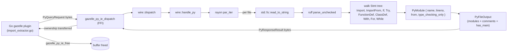

# import_extractor

Rust staticlib that extracts imports, comments, and `__main__` markers from Python source files. Linked into the gazelle plugin's `go_library` via cgo and dispatched in-process — no subprocess, no IPC.

## Why a Rust crate

Parsing Python correctly enough to drive `BUILD.bazel` generation is significantly easier in Rust than Go: [`ruff_python_parser`](https://github.com/astral-sh/ruff/tree/main/crates/ruff_python_parser) produces a real AST with error recovery (so a half-edited file mid-save still yields whatever could be parsed), and it's fast enough for the gazelle hot path. The crate parses each batch in parallel via `rayon`.

## How a single request flows



What we capture per file:

- **Modules**: every `import`/`from … import` reachable through the AST, including imports inside function/class bodies, `try` blocks, `with`/`for`/`while` blocks, and `if TYPE_CHECKING:` blocks.
- **`type_checking_only`**: true when the import sits inside an `if TYPE_CHECKING:` (or `if typing.TYPE_CHECKING:`) block. Gazelle's resolver doesn't differentiate today, but the field is on the wire so consumers can.
- **Line numbers**: 1-indexed, used for diagnostic output (`EXPLAIN_DEPENDENCY` etc.).
- **Comments**: every line that starts with `#` (after trimming whitespace). The Go side parses these into `# gazelle:ignore` / `# gazelle:include_dep` annotations.
- **`has_main`**: true when the file contains `if __name__ == "__main__":`. Surfaced through to the plugin even though the plugin doesn't currently use it to emit `py_binary`.

## C ABI

Two functions, declared in `src/ffi.rs`:

```c
void gazelle_py_ie_dispatch(
    const uint8_t *req_ptr,
    size_t req_len,
    uint8_t **out_resp_ptr,
    size_t *out_resp_len);

void gazelle_py_ie_free(uint8_t *ptr, size_t len);
```

`gazelle_py_ie_dispatch` decodes a protobuf `Request`, parses the requested files in parallel, encodes a `Response`, and hands ownership of the buffer back via the out-parameters. The caller releases it with `gazelle_py_ie_free`. The encoding follows the protobuf schema in [`../../proto/message.proto`](../../proto/message.proto).

## Layout

```
src/
├── lib.rs   # re-exports ffi, py, wire modules
├── ffi.rs   # C ABI surface (gazelle_py_ie_dispatch / gazelle_py_ie_free)
├── wire.rs  # protobuf request/response dispatcher
└── py.rs    # ruff-based Python AST visitor
```

## Build

```
bazel build //crates/import_extractor:import_extractor_static
bazel test  //crates/import_extractor:test
```

`import_extractor_static` produces a `.a` with `CcInfo`, which `//py:py` consumes via `cdeps` on its `go_library`. `opt.bzl` wraps it in a [`with_cfg`](https://github.com/fmeum/with_cfg.bzl) transition that pins compilation_mode=opt and the release rustc flags, so consumers building in `fastbuild` still get an optimized parser.

## Performance notes

The workspace `[profile.release]` sets `panic = "abort"`, `codegen-units = 1`, and `lto = "thin"`. The same flags are set via `@rules_rust//:extra_rustc_flags` inside the `with_cfg` wrapper so Bazel mirrors cargo's optimization profile. Calls into the FFI run on every directory Gazelle visits, so the parser staying tight matters.
