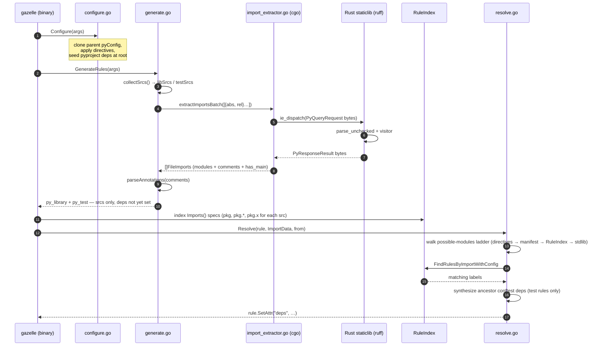
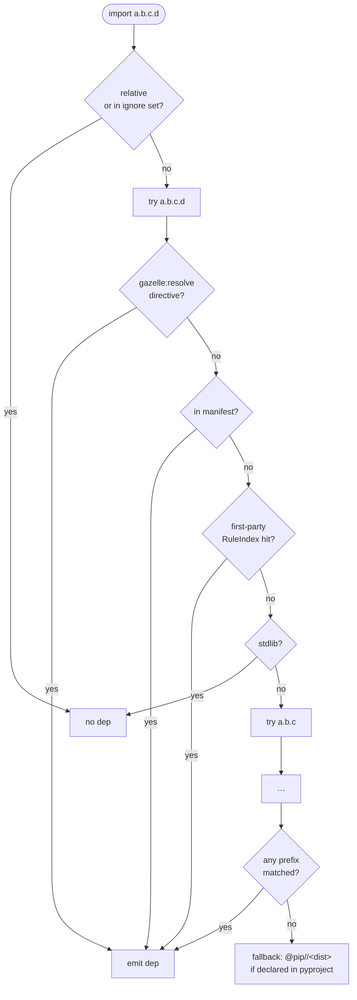

# py (Gazelle Python language extension)

A Gazelle language extension that generates and maintains BUILD files for Python packages. It emits stock [`rules_python`](https://github.com/bazelbuild/rules_python) `py_library` and `py_test` rules, leaving every project-specific concern (custom macros, pip linker layout, project layout, test runner) configurable via directives or [`# gazelle:map_kind`](https://github.com/bazelbuild/bazel-gazelle#directives).

## Quickstart

Add a `BUILD.bazel` at the repo root with:

```starlark
load("@gazelle//:def.bzl", "gazelle", "gazelle_binary")

gazelle_binary(
    name = "gazelle_bin",
    languages = ["@gazelle_py//py"],
)

gazelle(
    name = "gazelle",
    gazelle = ":gazelle_bin",
)
```

Then run `bazel run //:gazelle`.

`@gazelle_py//py` is a Gazelle Language; you compose your own `gazelle_binary` so it can be combined with other languages (`go`, `ts`, `proto`, …) into a single binary.

By default the plugin emits:

- `py_library` for libraries (loaded from `@rules_python//python:defs.bzl`)
- `py_test` for tests (loaded from `@rules_python//python:defs.bzl`)

If you have your own macros, use `# gazelle:map_kind` to swap.

## Architecture

The plugin runs through Gazelle's standard three-phase lifecycle. The diagram below traces a single directory's processing:



The Rust crate at [`../crates/import_extractor`](../crates/import_extractor) is built as a `rust_static_library` and linked into this `go_library` via `cdeps`. Calls into it go through cgo — no subprocess, no IPC.

## Resolution decision tree

For each import the resolver walks a "possible modules" ladder, trying progressively shorter dotted prefixes (`a.b.c.d` → `a.b.c` → `a.b` → `a`). At each prefix it checks every source in order before stepping shorter — that ordering matters: a single `# gazelle:resolve py <broad> <label>` directive must NOT steal an import that's actually a deeper, more specific submodule provided by another rule.



## Directives

All directives are placed in `BUILD.bazel` as `# gazelle:<key> <value>` and inherit into subdirectories.

All directive keys mirror [rules_python's gazelle plugin](https://rules-python.readthedocs.io/en/latest/gazelle/docs/index.html) so consumers can swap between the two without rewriting their BUILD-file directives. The one exception is `python_source_extension`, which has no rules_python analog — they hardcode `.py`/`.pyi`.

| Directive | Default | Notes |
|---|---|---|
| `python_extension` | `enabled` | `enabled` / `disabled` (also accepts `true`/`false`). Disable per-tree to skip directories owned by another tool. |
| `python_library_naming_convention` | _(package basename, e.g. `server` for `//apps/server`)_ | Name of the generated library rule. Supports the rules_python `$package_name$` placeholder (expands to the package basename). |
| `python_test_naming_convention` | _(package basename + `_test`)_ | Name of the generated test rule. Same `$package_name$` placeholder as the library convention. |
| `python_library_kind` | `py_library` | Override emitted library kind without `map_kind`. (Ours; rules_python doesn't have a kind override directive.) |
| `python_test_kind` | `py_test` | Override emitted test kind without `map_kind`. |
| `python_visibility` | `//visibility:public` | Space-separated label list. |
| `python_test_file_pattern` | `*_test.py`, `test_*.py`, `tests/**`, `test/**` | Comma-separated values **replace** the defaults (matches rules_python). A bare single value (no comma) is appended to the existing list as a convenience for adding one extra pattern. |
| `python_source_extension` | `.py` | Repeatable; appended. (Ours; rules_python hardcodes `.py`/`.pyi`.) |
| `python_generation_mode` | `package` | `package` / `file` / `project`. `package` emits one library + one test rule per directory. `file` emits one rule per source file (named after the file's basename). `project` rolls every `.py` under the directive's directory into a single library/test rule and skips generation in subdirectories — adopt only after clearing pre-existing per-package `BUILD.bazel` files in the subtree. |
| `python_skip_empty_init` | `false` | When true, skip emitting a library rule for a package whose only source is an empty (or comments-only) `__init__.py`. Packages with siblings still emit the rule and keep `__init__.py` in `srcs` so relative imports (`from . import x`) resolve. |
| `python_label_convention` | `@pip//{pkg}` | Template; `{pkg}` is replaced with the resolved distribution name. |
| `python_manifest_file_name` | _(empty)_ | Workspace-relative path to a `gazelle_python.yaml` (rules_python format). When set, its `modules_mapping` overrides built-in import → distribution heuristics, and its `pip_repository.name` swaps the repo segment of `python_label_convention`. |
| `python_root` | _(workspace root)_ | Marks the current package as the Python project root: dotted import paths under it are interpreted relative to this directory. Set on a parent BUILD file in monorepos with multiple Python projects sharing one workspace (e.g. `backend/`, `tools/python/`). The directive's value is ignored — it picks up the BUILD file's own path. |
| `python_resolve_sibling_imports` | `false` | When true, bare-module imports (`from app import X`) resolve as siblings of the importer's package. Lets a sibling `app.py` resolve to the local library even when the test references it as a top-level module name. Off by default to match rules_python and avoid surprising cross-package matches. |
| `python_label_normalization` | `snake_case` | How distribution names are normalized when rendering pip labels: `snake_case` (default; lowercase + `[-.]→_`), `pep503` (lowercase + runs of `[-_.]→-`), or `none` (identity). Pick `pep503` if your pip repo keys directly on PEP 503 names. |

### Per-source-file annotations

The plugin reads `# gazelle:` lines _inside Python source files_ during parsing:

```python
# gazelle:ignore foo,bar          # skip these modules in this file
# gazelle:include_dep //extra:dep # always add this dep to the rule
import foo
import bar
import baz
```

`# gazelle:ignore` accepts either space- or comma-separated module names. The match is prefix-based: ignoring `a.b` covers `a.b.c.D` and the `from` part of `from a.b import x`.

## How import resolution works

1. `pyproject.toml`, `requirements.txt`, and `requirements.in` (if present) are read once at the repo root for declared distribution names.
2. If `python_manifest_file_name` points at a `gazelle_python.yaml`, the file's `modules_mapping` is loaded once on first use.
3. Per import, run the possible-modules ladder shown above.
4. **Test rules** resolve only the imports the test files themselves declare — the sibling `:lib` target is reached transitively when the test imports it by module name. `conftest.py` at a package's own root is automatically extracted into its own `py_library` rule named `:conftest` with `testonly = True` (matching rules_python's gazelle plugin); it is NOT bundled into the package's main library. The plugin synthesizes imports for every ancestor directory containing a `conftest.py`, so the dedicated `:conftest` target is picked up transitively, while plain `from x.conftest import …` statements (and self-imports) are dropped.

## Running with a custom macro (`map_kind`)

Suppose you want to emit your own `myrepo_py_library` macro instead of stock `py_library`. Add to your root BUILD file:

```starlark
# gazelle:map_kind py_library myrepo_py_library //tools:py.bzl
# gazelle:map_kind py_test    myrepo_py_test    //tools:py.bzl
```

The plugin still emits the stock kinds; gazelle rewrites the kind name and load path on disk. Your macro must accept the attrs the plugin sets (`name`, `srcs`, `deps`, `visibility`).
